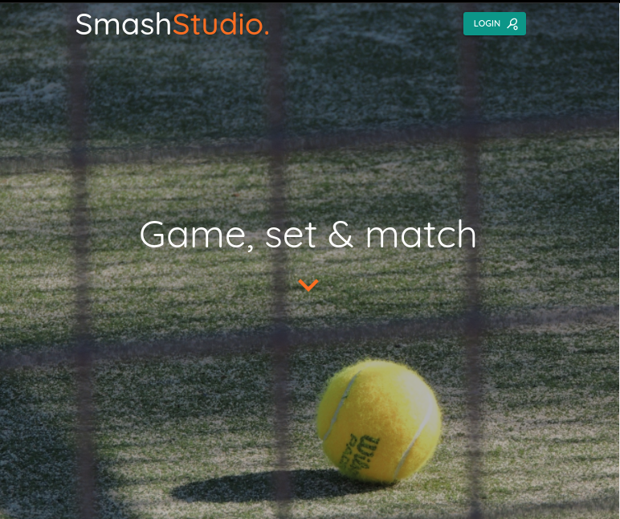
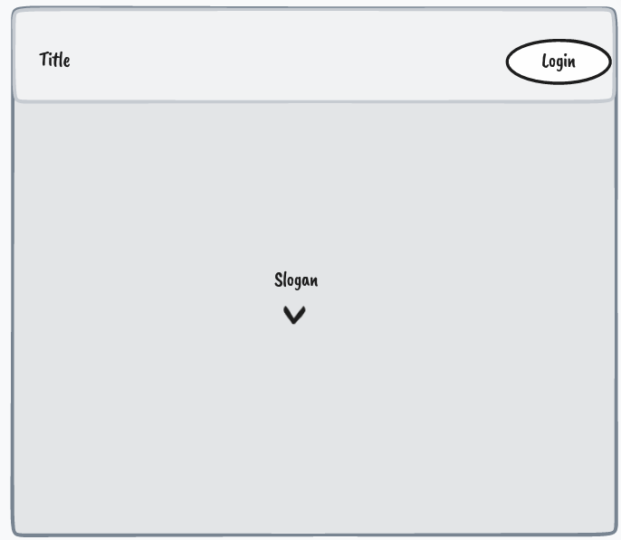
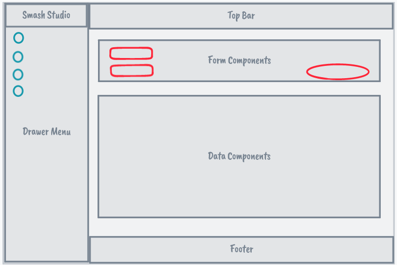

# ga-sei-ss

[Live site](https://smash-studio.herokuapp.com/landing)

Racket Club Management System.
Allows to manage your courts and give users flexibility to see and manage court reservations as well as provide a
platform for instructors to create classes and manage students

Main features:

- Manage users
- Manage instructors
- Manage courts
- Manage reservations
- Receive feedback from users

---

# Tech Stack

The site is built using the MERN stack:

- Mongo DB - NoSql DB
- Mongoose - ORM
- Express - Backend server
- NodeJS - JS Backend
- React - Front end
- DayJS - Backend
- Date-fns - Front end
- MUI - Front end

---

# User Stories

John is Smash Studio Admin:

- John can add, edit, delete courts on the system, which shows them to the end users when reserving a court
- John can list, invite, edit and delete users on the system
- John can list, add, edit or remove reservations on the system
- John can create, manage and delete classes
- John can see a dashboard with the performance of the courts and understand capacity for the time selected
- John can confirm attendees have a confirmation number

Mike is a tennis player who just discovered Smash Studio:

- Mike registers for an account
- Mike selects Add Reservation on the left menu
- Mike Selects a Tennis court Free at 2 pm
- Mike books it and receives email confirmation
- On arrival Mike shows confirmation email / number

Joan is a padel instructor and is working @ Smash Studio:

- Joan requests the creation of a new class to John
- Joan can add existing users to the lessons
- Joan can manage the schedule and court reservation for the class
- Joan can invite external users to register to participate in the class

---

# Wireframes and screenshots

- Landing Page:

- App Layout:

---

# Urgent Issues

- JWT token is not stored in an http-only cookie
- Issues with time conversion from UTC
- Little details with styling and spacing on experimental MUI components
- Role based routing on the Front End
- User Administration
- Editing a reservation has issues with the time picker

---

# Roadmap

## Near-Term

- Finalize admin pages
- Email notifications

## Long-Term

- Add server-sent events to provide push notifications
- Add inter-user messaging
- Add OpenID to allow using credentials from Gmail, Facebook or Twitter
- Add multi-factor auth for enhanced security
- Change the backend to Golang for added concurrency and speed
- Add score tracking capabilities
- Add utilization metrics and visualizations
- Add multi-user reservation (add/invite other users to the reservation)
- Court check-in
